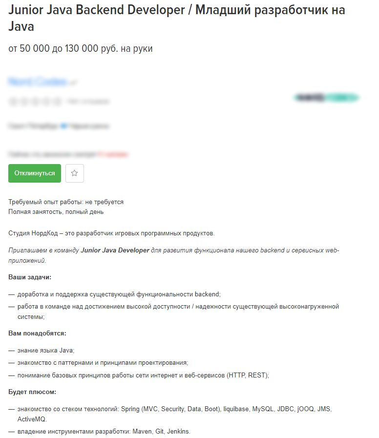

# Что я получу в конце пути?

В этом разделе книги будет перечислен набор знаний, технологий и навыков, освоив которые вы сможете претендовать на роль junior-разработчика на Java в компании, занимающейся разработкой веб-сервисов.

В целом для трудоустройства в большинство компаний вам потребуется:

* Знание основ Java, умение написать простой алгоритм или класс.
* Знание инструментария: IDE, Git, Gradle/Maven.
* Знание фреймворка Spring, умение создать простое веб-приложение на нем, умеющее что-то отдавать по сети и что-то хранить в БД. Понимание структуры такого приложения, какие там есть компоненты и кто за что отвечает.
* Базовые фундаментальные знания из Computer Science, которые уже [рассматривались ранее](../s-chego-nachat/chto-uchit-iz-klassicheskoi-computer-science.md).

В последующих главах все эти вопросы будут разобраны более подробно. Будут названы конкретные технологии, перечислены ссылки на статьи и полезные материалы. Будут разобраны некоторые теоретические вещи, для которых я не смог найти удовлетворяющего меня мануала или самоучителя.

Изучив все это самостоятельно и выполнив 1-2 учебных проекта, вы вполне сможете рассчитывать на прохождение собеседования на вакансию наподобие этой:&#x20;

