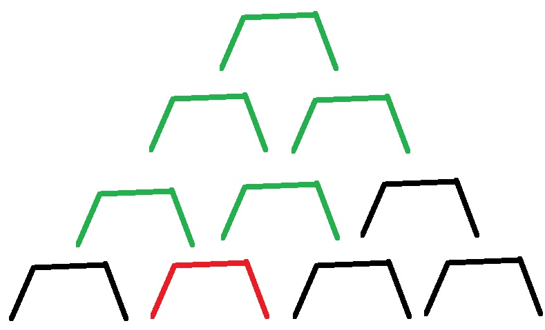

# Пример тестового задания

Вот пример реального тестового задания, которое я получил от одной компании много лет назад (компании той уже вроде и не существует, надеюсь, они не обидятся за публикацию). Его можно использовать как испытание своих сил или как пример уровня сложности того, что вам надо уметь делать, чтобы устроиться на позицию среднего разработчика.

Это задание в свое время было, кажется, на позицию Java-middle, то есть это не задание для начинающих. Технологии в тексте были немного изменены и актуализированы.

### Тестовое задание: Пирамида

Представим, что у нас есть пирамида, выстроенная из П-образных элементов, как на рисунке:

.png>)

Масса каждого из П-образных элементов 50 кг. Задачи:

1. Имплементируйте функцию `getHumanEdgeWeight(level, index)`. Функция должна возвращать значение массы, которую «несет» на своей верхней (горизонтальной) грани соответствующий элемент на соответствующем уровне. `level` – номер уровня пирамиды. `index` – номер элемента внутри уровня.
2. Имплементируйте простой HTTP-сервер, который сможет обрабатывать обращение к ресурсам:&#x20;
   1. GET /weight?level={level}\&index={index}&#x20;
   2. GET /weight/{level}/{element}&#x20;
3. Обращения к этим ресурсам должны возвращать результат работы функции `getHumanEdgeWeight` для переданных значений `level` и `index` (используйте `text/plain` в качестве content-type для response). Будьте готовы, что клиенты могут передавать некорректные значения параметров или обращаться к несуществующим ресурсам. Вы должны отвечать на такие запросы корректно с точки зрения HTTP-протокола. Будьте готовы к нагрузочному тестированию (\~10^2 одновременных запросов, \~10^3 запросов в секунду).
4. Используйте IoC-контейнер(Spring) для «связывания» следующих слоев:
   1. http-уровень&#x20;
   2. сервисный уровень, который обеспечивает доступ к определенной реализации алгоритма `getHumanEdgeWeight`
   3. конкретную реализацию алгоритма `getHumanEdgeWeight`
5. Используйте Gradle для сборки исполняемого JAR-файла. При запуске вашего JAR-файла должен стартовать ваш http- сервер, который должен обрабатывать обращения клиентов на порт 8080

Дополнительное изображение для пояснения пункта 1, для красного блока должен учитываться вес зеленых блоков:

