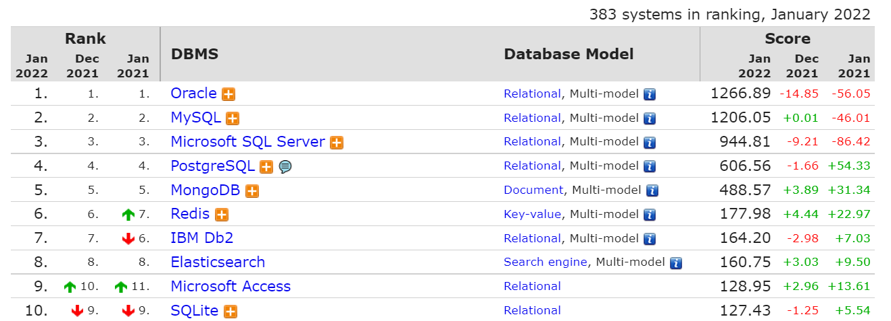

# Базы данных

Как уже говорилось в главе [tipichnye-zadachi-v-enterprise-razrabotke.md](../tipichnye-zadachi-v-enterprise-razrabotke.md "mention"), Enterprise разработка - это обычно перекладывание данных из одного хранилища/сервиса в другой, с некоторыми модификациями по дороге.&#x20;

А раз есть данные - надо их где-то и хранить.

В этой и в следующей главах пробежимся по верхам по основам баз данных и по работе с ними в Java. Данный текст не претендует на полноту освещения вопроса (так как он вполне тянет на семестровый университетский курс), но хотя бы позволит понимать, что это за классы в вашем Spring проекте такие, и каким образом ваши Java-объекты где-то там сохраняются.

Хороший набор учебных статей, в котором с самых основ объясняется, что такое БД, какие они бывают, какие технологии используются, есть на сайте [https://database.guide/what-is-a-database/](https://database.guide/what-is-a-database/). В этой главе будут даны лишь некоторые выдержки.

### Виды баз данных

В принципе, базой данных может быть все что угодно. Даже текстовый файлик или экселевская табличка - это уже в каком-то виде БД. Но табличка становится неудобной, когда данных много, надо делать по ним сложные выборки, у данных есть связи и т.п. В итоге люди придумали кучу специфических решений для хранений информации.

По-правильному программный комплекс, управляющий БД, называется "система управления базами данных", СУБД. Но часто в разговорной речи и саму базу с информацией, и управляющее ей ПО называют просто базой данных, БД.

СУБД придумано много разных, но в большинстве проектов используется 3-4 наиболее популярных разновидности, принадлежащих к 1-2 основным видам:



#### Реляционные БД

В обычной бытовой разработке наиболее популярны т.н. реляционные базы данных, в таблице выше они занимают 7 из 10 верхних строчек. В таких БД объекты представляются в виде таблиц заданной структуры, в которых столбцы - это поля данных, а строки - сами объекты. У каждого объекта должен быть уникальный идентификатор (первичный ключ), который может либо задаваться пользователем вручную (в таком случае надо самостоятельно следить за уникальностью), либо генерироваться самой СУБД (в таком случае уникальность гарантируется автоматически).

 (1).png>)

Кроме объектов в реляционной БД могут быть связи между ними. Например, на изображении выше таблица Ratings ссылается на записи в таблице Albums через столбец AlbumId. Из нее мы можем узнать, что у альбома с AlbumId=2 (то есть Black Ice) рейтинг равен 5. А таблица Albums ссылается на таблицу Artist, пройдя по этой ссылке мы можем узнать, что альбом Black Ice сыгран артистом номер 1, то есть AC/DC.&#x20;

Просто и логично, не правда ли? Именно эта интуитивность и привела к широкому распространению данного типа БД.

#### SQL

Рука об руку с понятием реляционной БД идет такая вещь как SQL. Это некий универсальный язык запросов (Structured Query Language), позволяющий писать запросы к такой БД для чтения или управления объектами в ней.

Например, если бы мы хотели выбрать рейтинг нашего Black Ice альбома, то написали бы запрос вида:

`SELECT Rating FROM Ratings WHERE AlbumId=2`&#x20;

SQL это очень популярная и известная вещь, по нему есть тысячи туториалов разной степени сложности. Например, на том же сайте [https://database.guide/sql-tutorial-for-beginners/](https://database.guide/sql-tutorial-for-beginners/), или на русском на Хабре [https://habr.com/ru/post/564390/](https://habr.com/ru/post/564390/)

Сразу отмечу, что понимание основ SQL крайне желательно, как и умение написать простой SELECT/INSERT запрос. Но углубляться в дебри, во всяком случае поначалу, не нужно. Учить всякие JOINы для начала точно не обязательно.

#### Популярные реляционные БД

Сам SQL - это лишь общий стандарт. Существует множество реализаций идеи реляционных БД, при этом они все используют свой собственный вариант SQL, которые часто несовместимы друг с другом. Общие идеи организации данных одинаковы в них всех, однако множество нюансов - по синтаксису языка запросов, по администрированию, по возможностям масштабирования - у разных БД разные.

Наиболее популярными в небольших компаниях являются MySQL и PostgreSQL. Они имеют бесплатные и опенсорсные версии, поэтому доступны для всех (в отличие от MSSQL и Oracle, которые предназначены для крупных компаний и стоят дорого).&#x20;

По моему опыту MySQL проще и интуитивно понятнее в установке и настройке, поэтому для небольших проектов и обучения я предпочитаю использовать ее. PostgreSQL несколько сложнее, зато лучше масштабируется и больше подходит крупным проектам. Но это тоже все холиварный вопрос, и пока у вас нет миллионов пользователей, вряд ли вы заметите разницу.

MySQL существует в виде двух вариантов - собственно MySQL и MariaDB. Второе является форком первого, развиваемое независимым сообществом, имеющее меньше лицензионных ограничений. С точки зрения использования (команд, запросов, администрирования) они практически эквивалентны.

В комплекте с MySQL можно скачать MySQL Workbench - GUI клиент для работы с БД.&#x20;

 (1) (1).png>)

Аналогичные инструменты существуют и для других СУБД, например pgAdmin для PostgreSQL.

#### Иные виды БД

Кроме реляционных БД существуют и другие виды: документоориентированные, базы "ключ-значение" и иные. Иногда их называют NoSQL, подчеркивая их отличие от реляционных БД, поддерживающих варианты языка SQL.

Из популярного можно назвать, например, MongoDB, Cassandra, Redis. Они могут отличаться отсутствием внутренней структуры, возможностью хранить произвольные данные (в отличие от реляционных БД, где структура таблиц жестко задана при создании), заточенностью на более эффективное выполнение отдельных операций на больших объемах данных.

Как правило, это нишевые решения. Несколько лет назад NoSQL были на хайпе, и казалось что они вытеснят классические реляционные БД, но этого не случилось. Более того, многие NoSQL решения в итоге переняли часть фич реляционных БД, например добавили к себе поддержку запросов на упрощенных диалектах SQL. Просто потому, что представление данных в виде объектов и связей между ними удобно для людей, работающих с данными.

#### Встроенные БД

Как правило, СУБД - это отдельное ПО, которое запускается на сервере или ПК, работает в фоновом режиме и обрабатывает приходящие по сети запросы.

Но иногда хочется вставить полноценную БД в какое-нибудь небольшое приложение, например для хранения локального кеша данных (актуально для Android), или для тестирования, чтобы тесты не зависели от внешних сервисов.

Для таких целей есть отдельное множество встроенных СУБД. Среди них могу отметить SQLite и H2. Обе являются встраиваемыми SQL решениями, которые можно использовать в своей Java-программе, без необходимости поднимать какие-то сервера и делать сетевые запросы. SQLite это старое известное решение, написанное еще на С, биндинги в SQLite есть практически во всех популярных языках программирования. H2 это чисто Java решение.

Их возможности часто ограничены по сравнению с "большими" СУБД (хуже производительность на больших объемах, нет поддержки многих удобных SQL конструкций), но для задач локального кеширования они отлично подходят.

### Как работать с SQL БД в Java

Как уже было сказано, типичная СУБД - это сервер, слушающий определенный порт и принимающий запросы по определенному протоколу. Конечно, за годы и десятилетия было создано множество высокоуровневых библиотек, позволяющих не тратить время на реализацию этого протокола самостоятельно. Ниже приведем основные технологии, использующиеся в Java.

#### JDBC

Из коробки в Java есть механизм работы с SQL БД, называемый JDBC - Java Database Connectivity. Это набор низкоуровневых классов, которые оборачивают создание подключения к БД, отправку SQL запросов и получение результатов.

Кроме базовых классов, идущих в комплекте с JDK, понадобится так же библиотека с реализацией для конкретной СУБД (т.н. драйвер). Например, для подключения к MySQL понадобится зависимость mysql-connector-java.

Грубо использование JDBC выглядит как:

1. Загрузка драйвера
2. Создание соединение с БД. Используются специальные URL адреса с протоколом JDBC, например `jdbc:mysql://localhost:3306/test_db`&#x20;
3. Создается запрос и отправляется через подключение
4. В ответ приходит ResultSet, содержащий поля ответа (значения столбцов)
5. Соединение и все прочие ресурсы (ResultSet, запрос) закрываются

Туториалов по JDBC в сети полно, например [https://www.baeldung.com/java-jdbc](https://www.baeldung.com/java-jdbc) и [https://www.baeldung.com/java-jdbc](https://www.baeldung.com/java-jdbc) и [https://javarush.ru/groups/posts/2172-jdbc-ili-s-chego-vsje-nachinaetsja](https://javarush.ru/groups/posts/2172-jdbc-ili-s-chego-vsje-nachinaetsja). Технология достаточно старая и последние годы не изменялась.

Для простого приложения, работающего с 1-2 таблицами и не имеющего серьезной нагрузки, этого может быть достаточно. Однако в более сложном приложении сразу начинаются сложности:

* Java-объекты в реальном приложении могут быть сложными, со множеством полей и связей, писать вручную SQL запросы для них утомительно и чревато ошибками.
* Ручное управление соединениями с БД быстро становится неэффективным и неудобным. Появляется необходимость переиспользовать соединения, кэшировать запросы и их результаты для повышения производительности.&#x20;

Для решения этих проблем создан ряд более высокоуровневых технологий и фреймворков.

#### ORM

Первую проблему - сложность в превращении объектов из ООП языка программирования в  запросы к реляционной БД - решают т.н. ORM фреймворки - Object-Relational Mapping.

Такие фреймворки есть в разных языках программирования и все работают примерно одинаково. Вы описываете классы сущностей, которые должны храниться в БД. Фреймворк на основе этого описания (это может быть просто код класса, код со специальными аннотациями, описание в виде XML или в любом другом формате) сам генерирует все необходимые SQL запросы и сам создает необходимую структуру БД.

Для Java существует несколько таких ORM фреймворков:

* Hibernate - наиболее мощный и популярный, про него будет рассказано в следующей главе
* Room - идет "из коробки" в последних версиях Android SDK. Намного более простой и примитивный, годится для простых БД
* OrmLite - еще один "простой" фреймворк, тоже часто используется в Android&#x20;
* И еще много всяких, разной степени популярности.

#### JPA

В какой-то момент в Java-сообществе возникло понимание, что ORM это очень удобно и без этого невозможно сделать нормальное серьезное приложение, работающее с БД. На тот момент уже существовало несколько популярных ORM решений, но они были несовместимы друг с другом, использовали разные методы конфигурации и описания структуры классов и сущностей в БД. В итоге возникло желание все это стандартизировать, и таким стандартом стал Java Persistence API - JPA.&#x20;

JPA задает интерфейс работы с ORM фреймворками в Java. Он содержит:

* Стандартные аннотации для классов, описывающие как именно они должны храниться в базе данных.
*   Язык запросов JPQL, который похож на SQL, но заточен под ООП природу Java, то есть в нем можно сразу использовать привычный по Java-коду синтаксис объектов и их полей. Например, в запросе ниже мы используем простые цепочки свойств b.publisher.name, не особо задумываясь, что это все разложено в разных таблицах в БД

    ```
    SELECT DISTINCT a FROM Author a INNER JOIN a.books b WHERE b.publisher.name = 'XYZ Press'
    ```


На момент создания JPA уже много лет самым популярным ORM фреймворком и стандартом де-факто в Java был Hibernate (о котором - в следующей главе). Поэтому создатели JPA не стали изобретать велосипед, а просто взяли интерфейсную часть Hibernate (его аннотации и его собственный язык запросов HQL) и сделали их стандартом де-юре.

Из-за этой схожести часто возникает путаница. По факту:

* Аннотации JPA являются подмножеством аннотаций Hibernate. Не все аннотации и параметры перекочевали из Hibernate в JPA. Поэтому иногда вы не можете найти каких-нибудь простых способов что-то сделать в JPA с помощью аннотаций из пакета `javax.persistence`, хотя есть аннотация с таким же именем в пакете `org.hibernate.annotations`, которая это делать умеет.
* Язык JPQL является подмножеством языка HQL. Любой валидный JPQL запрос является валидным запросом HQL, но не наоборот.

Важно понимать, что JPA - это _интерфейс_. В нем нет никаких генераторов запросов, подключений к БД и вообще внутренней логики. Это лишь стандартизованный способ описывать классы и запросы. А Hibernate - это _реализация_, наиболее популярная, но не единственная (есть еще EclipseLink, DataNucleus и другие). Которая выполняет реальную работу - берет классы, аннотированные JPA аннотациями, генерирует по ним SQL запросы, подключается к БД, выполняет запросы, попутно еще кеширует, оптимизирует и делает еще кучу всего.&#x20;

Ка и в случае с любым стандартны интерфейсом, вы можете заменять реализации, если они вас чем-то не устроили. Если ваши классы описаны в согласии со стандартом JPA, далее вы сможете подключить к своему проекту любую из реализаций, поддерживающих этот стандарт, и работать с БД с их помощью.

Разные реализации JPA могут отличаться по своим возможностям и уровню поддержки стандарта. Простые реализации (например OrmLite) могут поддерживать только ограниченное подмножество JPA аннотаций, или уметь сохранять только простые объекты, без циклических ссылок и сложных отношений.&#x20;

#### Пулы соединений&#x20;

Создание подключения к БД - довольно дорогостоящая с точки зрения производительности операция. Если в простом приложении вполне нормально открывать соединение на каждый запрос, и закрывать его после исполнения, то в нагруженном веб-сервисе это приведет к ощутимому падению скорости выполнения запросов.

Для решения этой проблемы есть различные реализации пулов соединений. В таких пулах поддерживается набор открытых соединений, которые не закрываются после выполнения запроса, а переиспользуются снова и снова.

Обзор популярных решений можно найти в статье [https://www.baeldung.com/java-connection-pooling](https://www.baeldung.com/java-connection-pooling)

Стоит отметить, что хотя ORM фреймворки используют пулы соединений внутри себя, можно использовать их и отдельно. Например, в вашем приложении есть только простые SQL запросы, ORM вам не нужен, но важна производительность - в таком случае вы можете использовать "голый" пул соединений, и писать запросы в него вручную с помощью базового JDBC.

### Заключение

Итак, в этой главе по верхам пробежались по основным технологиям работы с базами данных в Java. Каждая из рассмотренных технологий сама по себе может потребовать отдельного курса для изучения, но теперь вы хотя бы будете знать, какие именно ключевые слова искать самостоятельно.

В следующей главе рассмотрим подробнее Hibernate - стандарт де-факто при работе с БД в Java Enterprise разработке.

