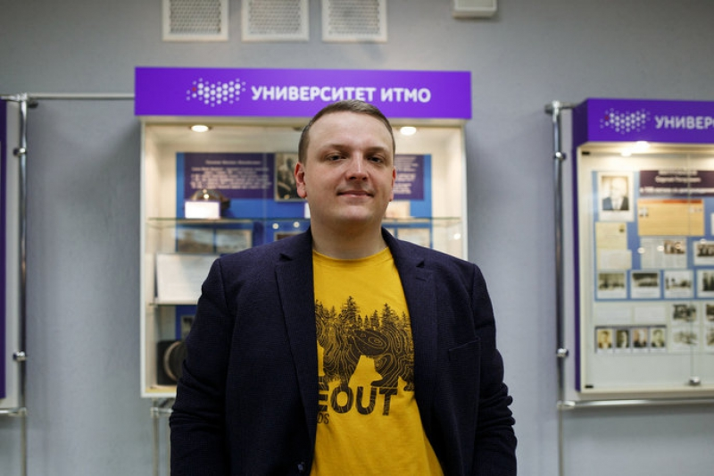

# Немного об авторе

Для начала немного обо мне: меня зовут Егор, я уже более 14 лет работаю программистом. Получил профильное образование в ИТМО, прошел путь от джуна до тимлида, занимался разными вещами, от Machine Learning и банковских приложений до разработки игр и софта для архитекторов. Работал и во фрилансе, и наемным сотрудником, был совладельцем небольшой ИТ-компании.

Про некоторые из своих разработок я пишу на Хабре. Мои статьи можно почитать тут:



Начинал я еще в те времена (середина нулевых), когда ИТ не было на такой волне хайпа как сейчас. Зарплаты программистов в России тогда были сравнимы с зарплатой любых других квалифицированных специалистов, и в ИТ в основном люди шли не за деньгами, а по зову сердца.

В свое время мне повезло, и я очень рано получил профориентацию и захотел стать программистом - еще в средней школе. Это позволило мне пройти по "правильному" и понятному пути, который я описываю в главе [put-v-it-cherez-vuz-esli-vy-eshe-shkolnik.md](../s-chego-nachat/put-v-it-cherez-vuz-esli-vy-eshe-shkolnik.md "mention"). Но это не значит, что в ИТ нельзя попасть в состоявшемся возрасте! Мне знакомы люди, которые в 40+ перешли сюда из других профессий и вполне успешно работают.

В последнее время мне уж очень часто стали писать друзья-знакомые и просить подсказать им какой-то курс для перехода в программисты. Я в целом всегда рад помочь, мне нравится обучать людей (а этим приходилось заниматься и в ВУЗе своем, и в спортивном клубе, и на конференциях выступать), но в какой-то момент мне надоело писать одно и то же каждый раз. И я решил оформить свой опыт в эту книгу.

Я доступен в соцсетях и мессенджерах - [https://vk.com/id1567](https://vk.com/id1567), [https://t.me/egorsmirnov88](https://t.me/egorsmirnov88), [https://www.instagram.com/smirnov.egor.v/](https://www.instagram.com/smirnov.egor.v/). Если есть вопросы и предложения - пишите, обсудим.
